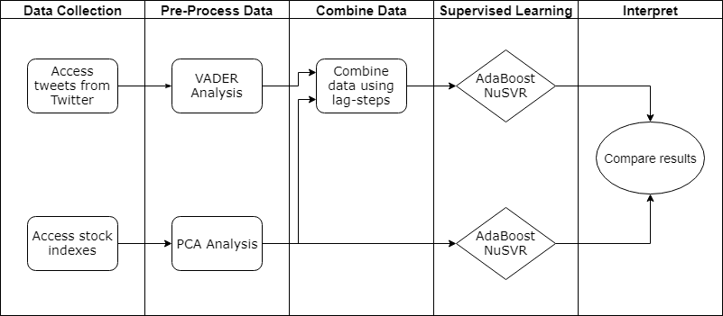

## Welcome to GitHub Pages

You can use the [editor on GitHub](https://github.com/patelrohan008/cx4240-stock-prediction/edit/master/README.md) to maintain and preview the content for your website in Markdown files.

Whenever you commit to this repository, GitHub Pages will run [Jekyll](https://jekyllrb.com/) to rebuild the pages in your site, from the content in your Markdown files.

# Motivation
<p align="justify">Our project focuses on predicting future stock changes using the attitude of social media posts (specifically Twitter). During the 20th century, the main investment theory was the Efficient Market Hypothesis (EMH). This theory states that the market reflects all the available information and that investors act rationally. However, the financial crises and the bubbles have demonstrated that sentiments and irrationality play a significant role in financial decision making. The Nobel Prize Robert Shiller challenged the EMH in an article in 1982 by comparing the US economy performances and the stock market during the 1920s. Several other distinguished economists have proved the presence of behavioral biases in stock market fluctuations. A new theory called “The Behavioral Finance Theory” attempts to explain these irrational components.</p>
<p align="justify">Today, the fact that there is a part of irrationality in the stock market fluctuations is widely accepted. In order to try to capture public sentiment, investors daily use confidence indexes, polls and surveys.</p>
<p>Meanwhile, social networks appear to be a relevant and innovative way to evaluate public mood. Whereas surveys are limited on the number of respondents, social networks enable to have access to the mood of millions of people at a very low cost. Moreover, several recent tweets had a significant impact on stock market. For instance, on August 7th, 2018, Elon Musk’s announcement about turning Tesla into a private company lead to a rise of Tesla’s stock price.


</p>

<p align="justify">Thus, our team is interested in using social networks like Twitter to improve stock market prediction.</p>


## Challenging the Efficient Market Hypothesis


## Our thesis
The movement of the market can be predicted by augmenting rational economic data, standard micro and macroeconomic predictive indexes, with a model quantifying irrational behavior, a sentiment analysis of social media.


# Approach

## Overview



## Gathering the Data

### Predictive Stock Market Indexes

### Social Media Sentiment Analysis

The first step in our sentiment analysis was to select a medium to pull data from. Twitter was selected as the preferred choice for two primary reasons. First, Twitter data is easily organized. Existing filters such as hashtags and verified users allow for flexible selection criteria. Second, individual tweets are short and succinct. This simplifies the analysis step as the model doesn’t need to interpret complex concepts such as the theme of a longer post. 

After choosing to examine Twitter data, the next step was to select a model to analyze each tweet. As the focus of this project was determining the influence social media sentiment had on the market rather than the methods of quantifying social media sentiment, a strong preference was placed on “out of the box” models. The model selected for sentiment analysis was the Valence Aware Dictionary and Sentiment Reasoner (henceforward referred to as VADER) developed by C.J. Hutto and Eric Gilbert. Again, there were several reasons for selection. First, this analysis tool is designed specifically to quantify social media sentiment. As a result, it has a number of particularly useful features, including the ability to understand slang, acronyms, and emojis. Second, VADER analysis supports sentiment intensity quantification meaning that degree modifiers, capitalization, and punctuation all play a role in the outputted result. Lastly, VADER quantification is easy to implement. Simply by calling a python package on the content of a tweet, VADER returns a composite score ranging from -1 to 1, where -1 corresponds to an extremely negative sentiment and 1 corresponds to an extremely positive sentiment. 

#### Feature Engineering

Once the model was selected, tweets for the relevant companies were scraped. Tweets were selected based on relevant hashtags, whether the user was verified, and whether the tweet was in English. Due to rate limitations, only tweets from January 1st, 2018 to the present were accessible. For each day the markets were open, the mean sentiment score, standard deviation sentiment score, and volume of tweets were calculated. On days the market was close, the scores and volume were assigned to the last day the market was open. For example, tweets on Saturday and Sunday were assigned to Friday, as Friday’s data would be used to predict Monday’s closing price. In order to account for the case that there were no tweets two binary features were created to correspond to the mean and standard deviation. The binary features were set to one if data was found for the given day, and zero otherwise. In the case that data was not found, the mean and standard deviation were imputed from the overall mean and standard deviation of all tweets pulled for the given company. 

## Selection of the companies and the technical indicators
### PCA Analysis
### Companies correlation study

#...

# Conclusions

# References
[1] J. Bollen and H. Mao. Twitter mood as a stock market predictor . IEEE Computer,
44(10):91–94.

[2] Carolyn Campbell, et al. Predicting Volatility in Equity Markets Using Macroeconomic
News . CS 229 Final Project, cs229.stanford.edu/proj2015/202_report.pdf.

[3] Shynkevich, Yauheniya & Mcginnity, T.M. & Coleman, Sonya & Belatreche, Ammar.
(2015). Predicting Stock Price Movements Based on Different Categories of News
Articles . 10.1109/SSCI.2015.107.

[4] Alexander Porshnev, et al. Machine Learning in Prediction of Stock Market Indicators
Based on Historical Data and Data from Twitter Sentiment Analysis . 2013 IEEE 13th
International Conference on Data Mining Workshops.

-------
Markdown is a lightweight and easy-to-use syntax for styling your writing. It includes conventions for

```markdown
Syntax highlighted code block

# Header 1
## Header 2
### Header 3

- Bulleted
- List

1. Numbered
2. List

**Bold** and _Italic_ and `Code` text

[Link](url) and 
```

For more details see [GitHub Flavored Markdown](https://guides.github.com/features/mastering-markdown/).

### Jekyll Themes

Your Pages site will use the layout and styles from the Jekyll theme you have selected in your [repository settings](https://github.com/patelrohan008/cx4240-stock-prediction/settings). The name of this theme is saved in the Jekyll `_config.yml` configuration file.

### Support or Contact

Having trouble with Pages? Check out our [documentation](https://help.github.com/categories/github-pages-basics/) or [contact support](https://github.com/contact) and we’ll help you sort it out.
