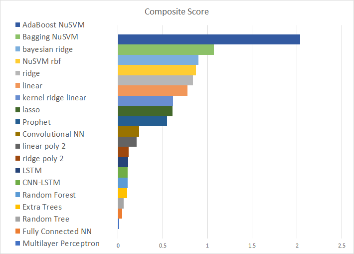

# Motivation
## Behavioral Finance

Our project focuses on predicting future stock changes using the attitude of social media posts (specifically Twitter). During the 20th century, the main investment theory was the Efficient Market Hypothesis (EMH). This theory states that the market reflects all the available information and that investors act rationally. However, the financial crises and the bubbles have demonstrated that sentiments and irrationality play a significant role in financial decision making. The Nobel Prize Robert Shiller challenged the EMH in an article in 1982 by comparing the US economy performances and the stock market during the 1920s. Several other distinguished economists have proved the presence of behavioral biases in stock market fluctuations. A new theory called “The Behavioral Finance Theory” attempts to explain these irrational components.

Today, the fact that there is a part of irrationality in the stock market fluctuations is widely accepted. In order to try to capture public sentiment, investors daily use confidence indexes, polls and surveys.

## The Choice of Twitter

Meanwhile, social networks appear to be a relevant and innovative way to evaluate public mood. Whereas surveys are limited on the number of respondents, social networks enable to have access to the mood of millions of people at a very low cost. 
We chose to use Twitter rather than another social network for several reasons. First, Twitter is one of most visited websites in the world where people express their moods and opinions. Thus, we can assume that Twitter better reflects public sentiment rather than another website. Then, Twitter’s content is public and classified by hashtags which make the collection of the tweets related to a topic easier. Third, individual tweets are short and succinct. This simplifies the analysis step as the model doesn’t need to interpret complex concepts such as the theme of a longer post.
Finally, several recent tweets had a significant impact on stock market. For instance, on August 7th, 2018, Elon Musk’s announcement about turning Tesla into a private company lead to a rise of Tesla’s stock price.

Thus, our team is interested in using social networks like Twitter to improve stock market prediction.

## Our thesis

The movement of the market can be predicted by augmenting rational economic data, standard micro and macroeconomic predictive indexes, with a model quantifying irrational behavior, a sentiment analysis of social media.

# Approach

## Goal

Show that including twitter sentiment analysis scores improves model prediction of the next days closing price.

## Overview

## Gathering the Data

### Predictive Stock Market Indices

Using the Alpha Vantage API, we had access to over 50 technical market indicators for any given company. Using all of these would have been impractical, as we didn't have the computing power to produce a predictive model using that many features in a reasonable amount of time. In order to lessen the load on our models, we set out to us SVD analysis to find the minimum number of indices that encompass the maximum possible variance of our data. For our analysis, we chose two large companies with low stock variance, Microsoft and Google, and two small companies with high stock variance, Qumu Corporation and Social Reality Incorporated.

After our initial analysis, we found that for every one of our four test companies, the dominant principal direction (associated with the largest eigenvalue) was significantly larger than any other direction, with this direction a factor of ~1000x larger than the second largest principal direction. This meant that the dominant principal direction accounted for over 99.8% of the variance for every one of our test companies. 

Taking the second largest principal direction in account pushed our lost variance to 10-6 %, meaning that we could reach a final verdict by only considering the top two largest principal directions for each company. With this information, our next step was to consider the dominance of each measurement in these principal directions. We considered a measurement to be dominant if it's absolute value in the normalized vector exceeded 0.1. We first gather information on the top principal directions alone.

This analysis revealed that there are only two technical measurements that appeared as outliers in the top principal direction for every company: HT_Sine (Index 53) and Quadrature (Index 58). When looking at only the large companies, Microsoft and Google, an additional two measurements appear as outliers: APO (Index 21) and Aroon Down (Index 29). Applying the same process to the smaller companies revealed two more common outliers: Real Middle Band (Index 41) and Midpoint (Index 43). Finally, while OBV (Index 50) was not an outlier in the top eigenvector for any company, it did appear dominant in the secondary eigenvector for every company. Taking this list of seven measurements, we had encompassed the majority of the variance of our data, while cutting the number of features by over 80%. 

Final List of Meaurements:
<ul>
  <li> APO (Index 21) <a href = "https://www.fidelity.com/learning-center/trading-investing/technical-analysis/technical-indicator-guide/apo">More Info</a> </li>
  <li> Aroon Down (Index 29) <a href = "https://www.investopedia.com/terms/a/aroon.asp">More Info</a> </li>
  <li> Real Middle Band (Index 41) <a href = "https://www.investopedia.com/terms/b/bollingerbands.asp">More Info</a> </li>
  <li> Midpoint (Index 43) <a href = "https://www.tradingtechnologies.com/xtrader-help/x-study/technical-indicator-definitions/midpoint-midpnt/">More Info</a> </li>
  <li> OBV (Index 50) <a href = "https://www.investopedia.com/terms/o/onbalancevolume.asp">More Info</a> </li>
  <li> HT_Sine (Index 53) <a href = "http://www2.wealth-lab.com/WL5Wiki/HTLeadSin.ashx">More Info</a> </li>
  <li> Quadrature (Index 58) <a href = "https://en.wikipedia.org/wiki/In-phase_and_quadrature_components">More Info</a> </li>
</ul>

#### Additional Stock Data

In addition to the technical indicators specific to a company, we also chose to add several general market indicators to account for events affecting the entire market. To accompish this, we included the open, close, high, low, and volume values of the NASDAQ.

### Social Media Sentiment Analysis

After choosing to examine Twitter data, the next step was to select a model to analyze each tweet. As the focus of this project was determining the influence social media sentiment had on the market rather than the methods of quantifying social media sentiment, a strong preference was placed on “out of the box” models. The model selected for sentiment analysis was the Valence Aware Dictionary and Sentiment Reasoner (henceforward referred to as VADER) developed by C.J. Hutto and Eric Gilbert. Again, there were several reasons for selection. First, this analysis tool is designed specifically to quantify social media sentiment. As a result, it has a number of particularly useful features, including the ability to understand slang, acronyms, and emojis. Second, VADER analysis supports sentiment intensity quantification meaning that degree modifiers, capitalization, and punctuation all play a role in the outputted result. Lastly, VADER quantification is easy to implement. Simply by calling a python package on the content of a tweet, VADER returns a composite score ranging from -1 to 1, where -1 corresponds to an extremely negative sentiment and 1 corresponds to an extremely positive sentiment. 

Below is an example of the VADER scores assigned to tweets about Boeing. A clear separation can be seen in the days prior to and the days after the Boeing 737 MAX crash and subsequent grounding. 

#### Feature Engineering

Once the model was selected, tweets for the relevant companies were scraped. Tweets were selected based on relevant hashtags, whether the user was verified, and whether the tweet was in English. Due to rate limitations, only tweets from January 1st, 2018 to the present were accessible. For each day the markets were open, the mean sentiment score, standard deviation sentiment score, and volume of tweets were calculated. On days the market was close, the scores and volume were assigned to the last day the market was open. For example, tweets on Saturday and Sunday were assigned to Friday, as Friday’s data would be used to predict Monday’s closing price. In order to account for the case that there were no tweets two binary features were created to correspond to the mean and standard deviation. The binary features were set to one if data was found for the given day, and zero otherwise. In the case that data was not found, the mean and standard deviation were imputed from the overall mean and standard deviation of all tweets pulled for the given company. 

### Combining the data and Introducing Lag

After combining the data to form a multivariate time series, more feature engineering was required. In order to assist the model in its predictions, lags were introduced as additional features. Lagging appends the features for n previous days to the current day, for example given a need to predict the stock price for day t + 1, lagging allows access to not only data from day t but also data from days t - 1, t - 2, ... up to t - n. For the models analyzed, a lag of three was introduced. 

# Methods

Once all necessary data had been acquired the next step was to find a predictive model. The general approach taken to this was to begin with simple linear models and increase model complexity. 

## Highlighting a Subset of Models Examined

### Linear Models

A variety of linear models were used: least squares, ridge, lasso, and Bayesian ridge regression were each evaluated using linear and polynomial regression. In general the linear models tended to outperform the polynomial models, with ridge and Bayesian ridge regression performing the best. It is likely that they outperformed the rest of the linear models due to strong regularization that prevented overfitting. 

### Kernel Transformation Models

The next set of models examined were models using kernels to transform the feature space. Using a series of different transformational kernels, kernel ridge regression and support vector regression were both analyzed. Kernel ridge regression performs the kernel trick on a dataset before implementing ridge regression and had the best results while using a linear transformation, while support vector regression which also performs the kernel trick but implements a different loss function worked best using the ‘rbf’ kernel. 

### Ensemble Learning Models

The next set of models are designed to increase the predictive capacity of the models examined earlier. Using a variety of linear, kernel-based, and decision tree models, a series of ensemble learning methods were tested, including bagging, random forests, and AdaBoost. Bagging and AdaBoost appeared to perform extremely well with the linear and kernel transformation models. However, closer inspection revealed that linear and kernel ridge regression tended to mirror movement of the stock, but one day later. As a result, ensemble methods using these regressions had low errors but produced unusable data. In contrast, ensemble learning was effective in transforming the support vector regressor into a stronger predictive model. AdaBoost, a method which fits a sequence of learners to slightly modified data sets, functioned extremely well in conjunction with support vector regression. 

Below, a graphic demonstrates the concepts involved in two types of ensemble learning.

### Neural Networks

A series of neural networks was implemented to try and outperform the models implemented earlier. Several neural network architectures were used: fully connected, convolutional, long short-term memory, and a hybrid convolutional and long short-term memory network consisting of a series of convolutions and max pools before an LSTM layer. Each of these networks faced a set of difficulties. The fully connected network drastically overfit the data even after the implementation of a validation set and dropout layer. The convolutional network struggled to follow the trend of the test data. The LSTM network took an extremely long time to train and overfit data as well, even after gaussian noise, dropout, and validation were all added. While the LSTM-CNN hybrid didn’t have the same training speed issues, the series of convolutions effectively denoised the gaussian noise that was added and resulted in overfitting. The problems from the LSTM network likely stemmed from a lack of data, while access to stock information is plentiful, rate limitations on twitter scraping limited the amount of accessible data to the past year and a half.  While Gaussian noise was designed to act as a form of data augmentation, in reality it was unable to make up for the lack of data. 

Below is a visualization of the CNN LSTM architecture implemented.

## Selecting the Model

 To compare between the various models examined, a composite scoring system was derived from three key metrics: R2, mean squared error, and explained variance. All three metrics were included to allow selection of a model that effectively follows the data. In the composite score, larger values are better. Certain models, for exampled ensemble learning methods implementing linear regression methods, were not included in the model selection due to the problems mentioned earlier. 

The results of the composite score are shown above. 

# Results and analysis

 

  

 

<h6>The graphs above display the results of testing the AdaBoost NuSVR model with 296 days of training data and 74 days of test data.</h6>

  
Looking at the charts show below, it can be seen that the use of Twitter data in the AdaBoost NuSVR model to predict the stock value of Microsoft <em><b><u>improves the average Mean Squared Error (MSE) by 39% and the average Explained Variance by 15%</u></b></em>.

 
  
# Conclusions

## Summary
Through this project, we have not only shown that raw market data is not enough to produce an effective predictive model, but also that there are irrational contributing factors that affect the values of a company's stock. We have also shown that these irrational factors can be modeled with some level of accuracy and applied to various predictive models to improve their accuracy at predicting the future values of stock. Through the use of several analytical concepts and machine learning methods, we have produced a model that can predict the stock value of a company tomorrow with only the tweets relevant to the company and a small set of technical indicators from today and the two days prior, and we have displayed that the accuracy of this model is significantly improved by the use of the data associated with the tweets. Lastly, the steps taken in this project have brought us closer to understanding the many abstract factors that go into the daily movement of the stock.

## Limits of Twitter data

This study has shown that Twitter can improve stock prediction. However, the use of Twitter for stock market prediction has some limits. First, Twitter is particularly used in the United States and therefore reflects more American public sentiment rather than the world opinion. Moreover, it is sometimes difficult to extract enough relevant tweets related to a company. Usually when it is a large company, it is more likely to find many tweets. But it is not a general truth. For example, we did not find numerous tweets related to AMD. As Delta Airlines is concerned, many tweets were consumer complaints or discussions with the customer service. In that case, those tweets had to be filtered.

## Next steps

### Twitter Analysis

Currently, the model used to calculate the sentiment of tweets in the project has only one numerical indicator applied to each tweet. This model could be improved by introducing several more complex indicators to provide more information towards the overall sentiment towards the given company.

### Neural Networks

The machine learning models used in this project were all relatively simple compared to those available for use. Given more time and computing power, significantly more complex models could be produced that would provide either more accurate predictions or a broader range of applicable companies for which the model would be useful.

### Test the models on other stock companies

We can later try the models on other stock companies. An analysis of correlation between several companies gives two examples of stocks (CVS, Boeing) that are negatively correlated to the whole stock market. Thus, more negative tweets are likely to be extracted. It would be interesting to see how the models react to this more probable percentage of negative tweets. The Alpha Vantage API enables to display the performances of the main sectors of the economy and can help to choose new companies to test.

  
 

# References
[1] J. Bollen and H. Mao. Twitter mood as a stock market predictor . IEEE Computer,
44(10):91–94.

[2] Carolyn Campbell, et al. Predicting Volatility in Equity Markets Using Macroeconomic
News . CS 229 Final Project, cs229.stanford.edu/proj2015/202_report.pdf.

[3] Shynkevich, Yauheniya & Mcginnity, T.M. & Coleman, Sonya & Belatreche, Ammar.
(2015). Predicting Stock Price Movements Based on Different Categories of News
Articles . 10.1109/SSCI.2015.107.

[4] Alexander Porshnev, et al. Machine Learning in Prediction of Stock Market Indicators
Based on Historical Data and Data from Twitter Sentiment Analysis . 2013 IEEE 13th
International Conference on Data Mining Workshops.

[5] VADER: A Parsimonious Rule-based Model for Sentiment Analysis of Social Media Text
(by C.J. Hutto and Eric Gilbert)
Eighth International Conference on Weblogs and Social Media (ICWSM-14). Ann Arbor, MI, June 2014

[6] Wang, Jin & Yu, Liang-Chih & Lai, K & Zhang, Xuejie. (2016). 
Dimensional Sentiment Analysis Using a Regional CNN-LSTM Model. 225-230. 10.18653/v1/P16-2037. 

[7] Ensemble learning visual retrieved from:
https://www.datacamp.com/community/tutorials/adaboost-classifier-python
